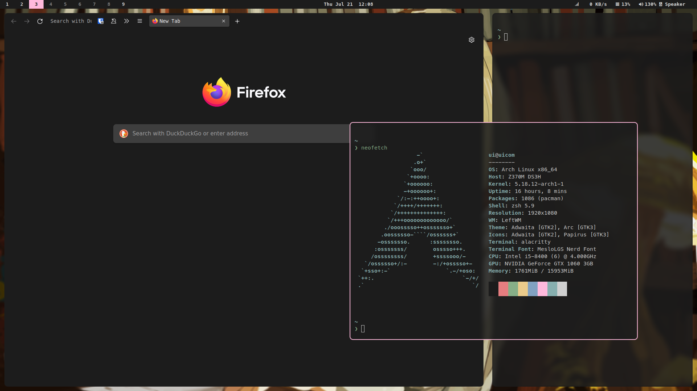

# This Is My Configuration



## Installed

Basic
```
base-devel
xorg xorg-xinit xwallpaper
xdg-user-dirs
alsl-utils
git
wget
openssh
```

Setup
```
alacritty           # terminal emulator
kitty               # terminal
bspwm               # windows manager
leftwm              # wm
sxhkd               # keybinding
(aur) polybar       # status bar
(aur) eww           # status bar
zsh                 # shell
nushell             # shell
rofi                # launcher and more
firefox             # browser
qutebrowswer        # browser

pipewire-jack       # audio
pipewire-pulse
pipewire-alsa

(aur) picom-jonaburg-git    # compositor
nitrogen            # wallpaper
setxkbmap           # uses it to remap capslock to ctrl

cronie              # auto exec tasks at pre-determined times
ntp                 # clock fixer
xclip               # let nvim can use system clipboard

#(aur) quickemu quickgui     # virtual machines
qemu
(aur) aqemu

neomutt
isync

xf86-input-wacom            # wacom setting tool `$ xsetwacom `
```


Commandline tool
```
tmux
(aur) lf            # file manager
- nsxiv             # image viewer (install from git@github.com:luck07051/nsxiv.git)
ueberzug            # image viewer (to view image in terminal)
zathura zathura-pdf-mupdf   # pdf viewer
#ncmpcpp             # music player
#(aur) ncpamixer     # pulseaudio control

icdiff              # diff tool
delta               # diff tool (called 'git-delta' in pacman)
ffmpeg ffmpegthumbnailer    # audio/video conversion tool
youtube-dl          # youtube downloader
pactl               # pulse control

tealdeer            # tl;dr

slidev              # slides maker. use this install `$npm i -g @slidev/cli`
                    # for export, `$npm i -g -D playwright-chromium`

fzf                 # fuzzy finder
starship            # prompt
exa                 # better ls
htop                # better top
btop                # better top
bat                 # better cat
procs               # better ps
zoxide              # better cd
fd                  # better find
sd                  # better sed
ripgerp             # better gerp
dust                # disk usage
hexyl               # hex viewer
xdotool
```

Graphical app
```
flameshot           # screenshot
thunar              # file manager
pavucontrol         # pulseaudio control
gimp                # draw app
vlc                 # video viewer
mpv                 # video viewer
```

Dependency
```
# vim plug markdown perviewer
yarn
# vimtex
texlive-most
```

Nvidia
```
nvidia
nvidia-utils
nvidia-settings
nvtop
```

Gtk theme
```
arc-gtk-theme
papirus-icon-theme
```

Font
```
(aur) nerd-fonts-complete
(aur) adobe-source-han-sans-otc-fonts
(aur) noto-fonts-cjk
xorg-fonts-misc
```


## NOTE

### yay
```
$ git clone https://aur.archlinux.org/yay-git.git
$ cd yay-git
$ makepkg -si
rm yay-git
```

### vim

If markdown-preview dont work, try `:call mkdp#util#install()`

##### ycm
```
(aur) vim-youcompleteme-git
sudo pacman -S python-pynvim

cd .../plugged/YouCompleteMe
/usr/bin/python install.py --all
```


### lf
see [image preview](https://github.com/cirala/lfimg)


### pip
```
sudo pacman -S gcc python3-dev python-pip
```


### qutebrowser
Unable to view DRM content
```
(aur) chromium-widevine
```


### changing default shell
```
chsh -l
chsh -s full-path-to-shell
```


### [dotfile](https://www.atlassian.com/git/tutorials/dotfiles)
Install onto a new system
```
alias config='/usr/bin/git --git-dir=$HOME/.dotfiles/ --work-tree=$HOME'
echo ".dotfiles" >> .gitignore
git clone --bare git@github.com:luck07051/dotfiles.git $HOME/dotfiles
alias config='/usr/bin/git --git-dir=$HOME/.dotfiles/ --work-tree=$HOME'
# backup the file will be overwritten
if config checkout > /dev/null 2>&1; then
  mkdir -p .config-backup && \
    config checkout 2>&1 | grep "^\s+" | awk {'print $1'} | \
    xargs -I{} mv {} .config-backup/{}
fi
config config --local status.showUntrackedFiles no
```
or `curl -Lks https://raw.githubusercontent.com/luck07051/dotfiles/main/.local/bin/mybin/config-install | /bin/bash` (testing yet)


### [steam](https://www.chrisatmachine.com/Linux/08-steam-on-linux/)
If text is corrupt
` pacman -S  lib32-fontconfig ttf-liberation wqy-zenhei `


### if default browser incorrect
```
xdg-mime default $(xdg-settings get default-web-browser) x-scheme-handler/https x-scheme-handler/http
```


### xinput
```
ln ~/.config/X11/xorg.conf.d/[] /etc/X11/xinit/xorg.conf.d/
```

### clock drift
```
sudo pacman -S ntp
sudo ntpd -qg
sudo hwclock --systohc
```
or (idk this will work)
```
sudo systemctl enable ntpd.service
sudo systemctl start ntpd.service
```


### MATLAB
if matlab can't install
```
downgrade cairo
```


### Firefox
#### CSS
Open `about:config` page.
```
    toolkit.legacyUserProfileCustomizations.stylesheets
    layers.acceleration.force-enabled
    gfx.webrender.all
    gfx.webrender.enabled
    layout.css.backdrop-filter.enabled
    svg.context-properties.content.enabled

    layout.css.color-mix.enabled
```
Then make sure to enable them all.


### Cron
enable cron
```
systemctl enable cronie
systemctl start cronie
```

put this in `crontab -u root -e`
```
# sync clock everyday at 8pm
0 20 * * * /usr/bin/ntpd -qg; /usr/bin/hwclock --systohc
```

if `notify-send` didnt work, add this in `crontab -e`
```
DISPLAY=":0.0"
XAUTHORITY="/home/ui/.Xauthority"
XDG_RUNTIME_DIR="/run/user/1000"
```

if gui not work well, try `xhost +local:`
(https://help.ubuntu.com/community/CronHowto#GUI%20Applications)


### GRUB
[Hidden menu](https://wiki.archlinux.org/title/GRUB/Tips_and_tricks#Hidden_menu)

Fix resolution, add these in /etc/default/grub
```
GRUB_CMDLINE_LINUX_DEFAULT="nomodeset"
GRUB_GFXPAYLOAD_LINUX=1920x1080
```
remember comment default setting


### Input method
install:
- fcitx5
- fcitx5-configtool
- fcitx5-gtk
- fcitx5-qt
- fcitx5-rime
- fcitx5-mozc
- theme: https://github.com/catppuccin/fcitx5

If not want fcitx5 overrides xkeyboard.
Use fcitx5-configtool to uncheck Addons → XCB → Allow Overriding System XKB Settings.

Add these to `/etc/environment`
```
GTK_IM_MODULE=fcitx
QT_IM_MODULE=fcitx
XMODIFIERS=@im=fcitx
SDL_IM_MODULE=fcitx
```


### QEMU libvirt
```
sudo pacman -S libvirt
sudo pacman -S qemu
sudo pacman -S iptables-nft dnsmasq dmidecode bridge-utils openbsd-netcat
sudo pacman -S virt-manager

sudo nvim /etc/libvirt/libvirtd.conf
uncomment
#unix_sock_group = "libvirt"
#unix_sock_ro_perms = "0777"  # set to 0770 to deny non-group libvirt users
#unix_sock_rw_perms = "0770"

systemctl start libvirtd

sudo usermod -aG libvirt [username]
```

### st emoji support
```
yay -S libxft-bgra
```


### office
install ms fonts
`yay -S ttf-ms-fonts`

[make libreoffice more compatible](https://yt.uima.xyz/https://www.youtube.com/watch?v=G0che2Az9hw#)
